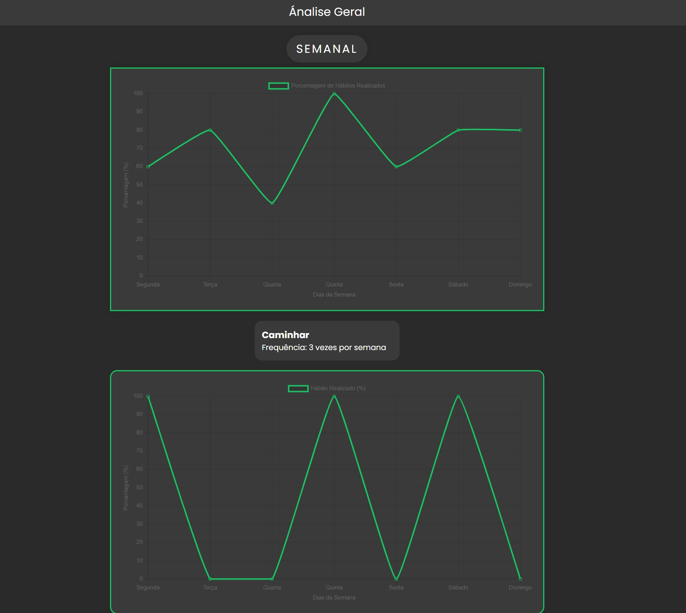
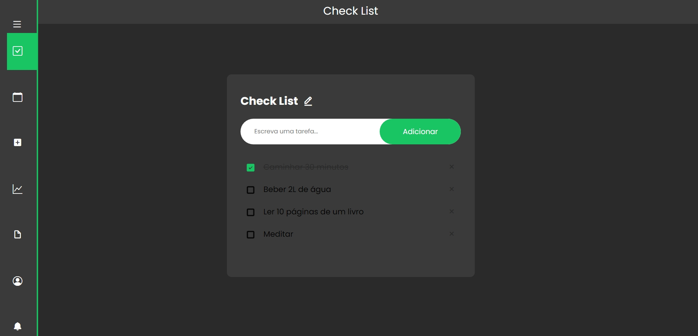
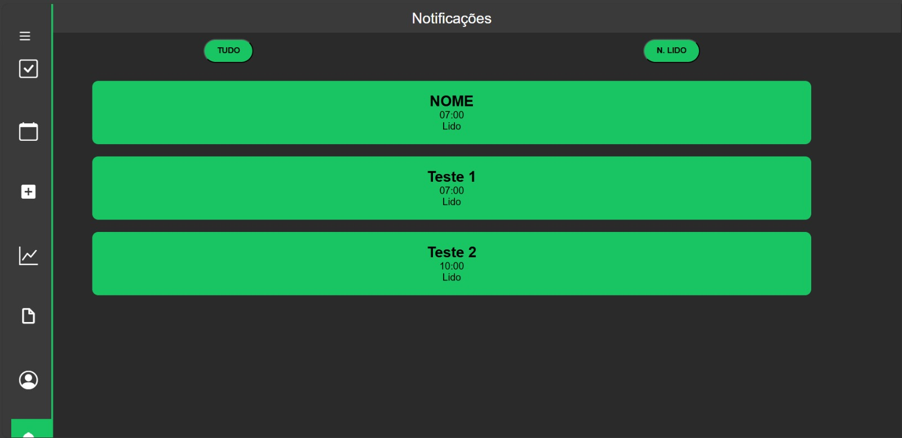
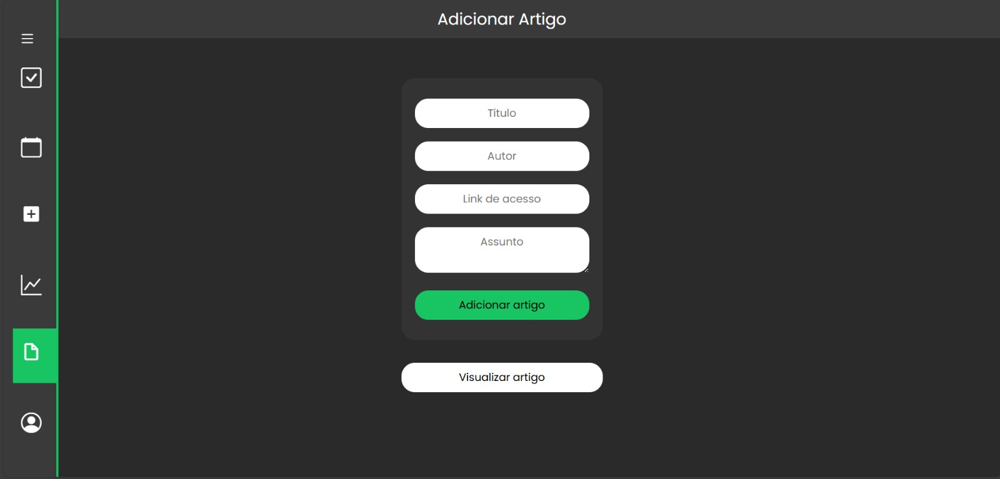
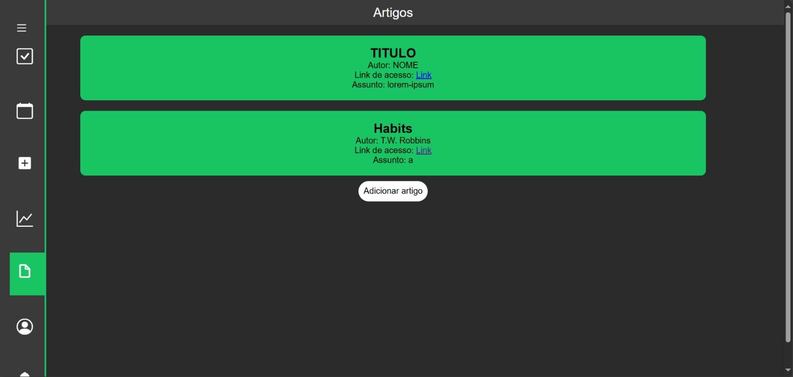
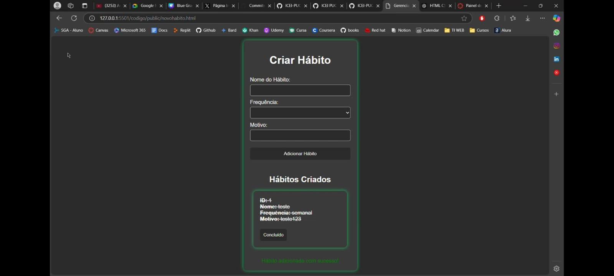
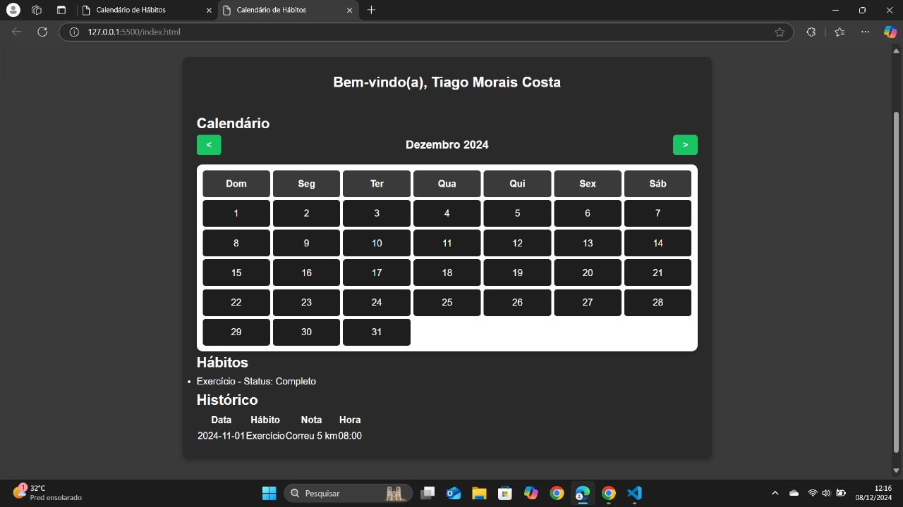
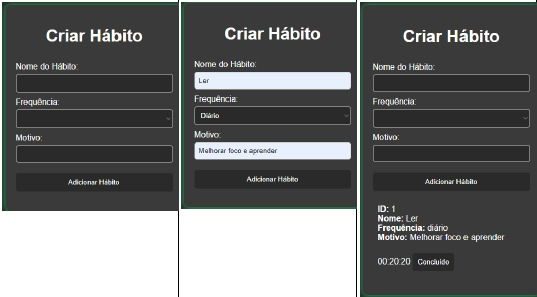
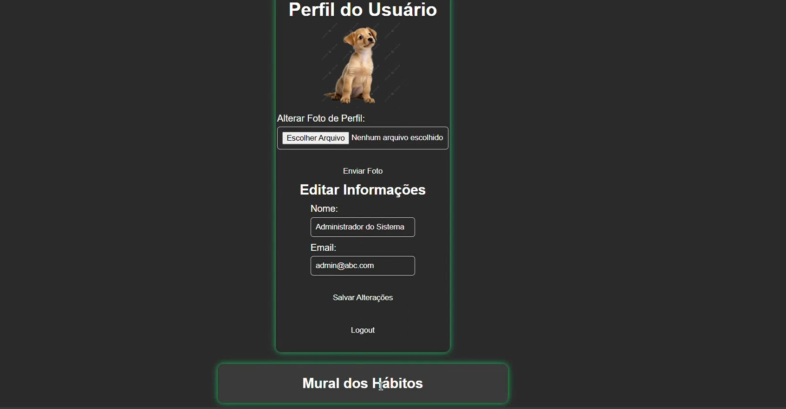

# Introdução

Informações básicas do projeto.

* **Projeto:** Criar e Retirar Hábitos
* **Repositório GitHub:** [LINK PARA O REPOSITÓRIO NO GITHUB](https://github.com/ICEI-PUC-Minas-PMGCC-TI/ti-1-ppl-cc-m-20242-g6-criar-e-desfazer-habitos/tree/master)
* **Membros da equipe:**

  * [Thiago Gomes](https://github.com/Thigogomes)
  * [Tiago Costa](https://github.com/Tiagomcosta10)
  * [Felipe](https://github.com/ilipehwd)
  * [Diego](https://github.com/Diegogeladin)

A documentação do projeto é estruturada da seguinte forma:

1. Introdução.
2. Contexto.
3. Product Discovery.
4. Product Design.
5. Metodologia.
6. Solução.
7. Referências Bibliográficas.

✅ [Documentação de Design Thinking (MIRO)](files/processo-dt.pdf)

# Contexto

O tema do projeto é a dificuldade de criar e se desfazer de hábitos, algo comum entre estudantes universitários, especialmente considerando as pressões acadêmicas e sociais. O objetivo do projeto é desenvolver um aplicativo que auxilie esses estudantes a melhorar sua rotina e hábitos diários, seja no abandono de comportamentos prejudiciais ou na adoção de práticas saudáveis. O público-alvo são estudantes universitários que lidam com questões como procrastinação, vícios e a organização do tempo. O aplicativo será desenvolvido em HTML e CSS, com foco em acessibilidade, interface intuitiva e ferramentas  motivacionais.

## Problema

Muitos estudantes universitários enfrentam dificuldades para criar e manter hábitos saudáveis, assim como para se livrar de vícios prejudiciais. Isso se deve a fatores como a sobrecarga acadêmica, a pressão social, a falta de orientação sobre como formar hábitos e a ausência de um sistema de apoio efetivo. Em ambientes universitários, problemas como procrastinação, vícios (tabagismo, apostas, etc.), desorganização de rotina e falta de motivação são comuns. Essas dificuldades impactam não só o desempenho acadêmico, mas também a saúde física e mental dos alunos, o que gera uma necessidade de ferramentas que auxiliem na gestão pessoal e no desenvolvimento de novos hábitos.

## Objetivos

Objetivo Geral:
Desenvolver um aplicativo que ajude estudantes universitários a criar e desfazer hábitos, com funcionalidades focadas em motivação, monitoramento e apoio à comunidade.

Objetivos Específicos:
Criar um sistema de monitoramento diário que permita o acompanhamento do progresso dos hábitos, oferecendo lembretes e recompensas.
Implementar uma funcionalidade de comunidade que permita aos usuários compartilhar experiências e se motivar mutuamente, facilitando o suporte entre pares.
Desenvolver um sistema de gamificação para incentivar o uso contínuo e o progresso do usuário, promovendo o engajamento através de desafios e recompensas personalizadas.

# Justificativa

O desenvolvimento deste aplicativo é importante devido ao impacto direto que a criação ou abandono de hábitos pode ter na vida dos estudantes universitários. Estudantes, como Edyvânia e João, enfrentam obstáculos para mudar comportamentos que afetam seu bem-estar e desempenho acadêmico. A solução proposta visa preencher a lacuna entre a teoria da formação de hábitos e sua aplicação prática no dia a dia dos usuários, por meio de uma plataforma acessível e intuitiva, que oferece motivação contínua e suporte. A decisão de incluir elementos de gamificação e uma comunidade de apoio baseia-se em entrevistas realizadas com estudantes, que indicaram a necessidade de um sistema de recompensas e de interação social para manter o engajamento.

## Público-Alvo

O público-alvo principal deste aplicativo são estudantes universitários de diversas áreas de estudo, com idades entre 18 e 30 anos, que enfrentam desafios relacionados à criação de hábitos saudáveis ou à eliminação de hábitos prejudiciais. Esses estudantes têm um nível intermediário de familiaridade com tecnologias e dispositivos móveis, utilizando aplicativos de maneira frequente, principalmente para organização pessoal, redes sociais e lazer. As personas criadas para representar esse público incluem Edyvânia, uma estudante extrovertida que quer parar de fumar e organizar melhor sua rotina, e João, um estudante introvertido que deseja largar o vício em apostas e melhorar sua saúde física frequentando a academia. Essas personas refletem a diversidade de perfis e motivações dos estudantes universitários, além de suas necessidades específicas.

# Product Discovery

## Etapa de Entendimento

**Matriz CSD**


**Mapa de Stakeholders**<br>


**Entrevistas qualitativas**


**Highlights de pesquisa**


## Etapa de Definição

### Personas

##### Edyvania

Edyvania, mulher de 25 anos, pobre, brasileira, mora em Belo Horizonte, Minas Gerais, ela é estudante do oitavo período de direito, e estagiaria em um escritório de advocacia. Ela tem um grande vicio em fumar, e usa isso para se acalmar. Ela está estudando para prestar a prova da OAB. no seu tempo livre ela gosta de ver series e domaras, e também de estudar coreano, ela gosta de passar tempo com seus dois irmãos mais novos e sua mãe e padrasto, e também sair com seu namorado. Ela precisa de ajuda para conseguir se organizar e a criar o hábito de estudar na sua rotina que é bem corrida, ela costuma perder seu tempo procastinando nas redes sociais, e também quer melhorar a sua saúde parando de fumar, pois a prejudica muito, principalmente a sua respiração. Ela é bastante extrovertida, comunicativa e expressiva, ela tem pouca paciência.


##### João

João, homem de 19 anos, classe media, brasileiro, mora em Sabará, Minas Gerais, ele é estudante do segundo período de enfermagem. Ele gosta de tocar violão e de musica no geral, e de esportes principalmente futebol, mas só joga as vezes,  e também gosta de sair com seus amigos. Ele acaba sendo bem sedentário na maior parte do tempo, e ele gostaria de mudar isso começando a fazer academia. ele também tem um vicio em apostas esportivas, que adquiriu por influencia de seus amigos, e por causa disso ele acaba perdendo muito de seu dinheiro. Ele pretende abandonar seu vicio em apostas, tentar manter uma frequência na academia, e conciliar isso com a faculdade e sua rotina de estudos. Ele é bastante tímido e introvertido, mas também é bem emotivo.


# Product Design

Nesse momento, vamos transformar os insights e validações obtidos em soluções tangíveis e utilizáveis. Essa fase envolve a definição de uma proposta de valor, detalhando a prioridade de cada ideia e a consequente criação de wireframes, mockups e protótipos de alta fidelidade, que detalham a interface e a experiência do usuário.

## Histórias de Usuários

Com base na análise das personas foram identificadas as seguintes histórias de usuários:

| EU COMO...`PERSONA` | QUERO/PRECISO ...`FUNCIONALIDADE`        | PARA ...`MOTIVO/VALOR`               |
| --------------------- | ------------------------------------------ | -------------------------------------- |
| Estagiária  e estudante | Algo fácil de se usar       | Não precisar passar muito tempo pra aprender usar. |
| Alguém que procrastina em redes sociais  | De que as notificações sejam bloqueadas    | Conseguir me concentrar melhor nos estudos |
| Fumante   | Contador de quantos dias sem fumar |  ter maior controle do meu avanço e motivação      |
| Um cara com dificuldade de manter a constância   | De algo que me incentive a continuar | Me motivar a continuar |
|  Alguém que se frustra facilmente   | Mesagem de motivação | Manter meu progresso   |
|  Usuário do aplicativo   | Lembretes diários | Me lembrar de fazer as tarefas  |
|  Viciado em apostas esportivas   | Bloquear meu acesso a sites de aposta | Me impedir de jogar |

## Proposta de Valor

##### Proposta para Edyvania


##### Proposta para João


## Requisitos

As tabelas que se seguem apresentam os requisitos funcionais e não funcionais que detalham o escopo do projeto.

### Requisitos Funcionais

| ID     | Descrição do Requisito                                   | Prioridade |
| ------ | ---------------------------------------------------------- | ---------- |
| RF-001 | Cadastro de usuário | ALTA       |
| RF-002 | Área de criação de hábitos | ALTA    |
| RF-003 | Lembretes diários | MÉDIA  |
| RF-004 | Histórico de cada hábito  | ALTA  |
| RF-005 | Comunidade de apoio| BAIXA  |
| RF-006 | Gamificação | BAIXA  |
| RF-007 | Calendário | ALTA |
| RF-008 | Bloqueio de notificações | MÉDIA  |
| RF-009 | Motivadores | MÉDIA |
| RF-010 | Análise da constância  dos  hábitos | ALTA |


### Requisitos não Funcionais

| ID      | Descrição do Requisito                                                              | Prioridade |
| ------- | ------------------------------------------------------------------------------------- | ---------- |
| RNF-001 |  O site tem que ser intuitivo e fácil de se usar | ALTA |
| RNF-002 | O site tem que ter uma boa acessibilidade e funcionamento no celular também  | MÉDIA      |
| RNF-003 |  O aplicativo deve ser rápido e responsivo, garantindo uma boa experiência ao usuário  | ALTA   |
| RNF-004 | O sistema deve estar disponível 24 horas por dia     | ALTA     |
| RNF-005 |  As informações do usuário devem ser protegidas e armazenadas de forma segura | ALTA     |
| RNF-006 |  O sistema deve responder rápidamente | ALTA     |

## Projeto de Interface

Artefatos relacionados com a interface e a interacão do usuário na proposta de solução.

### Wireframes

Estes são os protótipos de telas do sistema.

**Página inicial**<br>
Onde o usuário visualizará as tarefas que ele tem para o dia para manter seus hábitos.


**Pagina de criação de hábitos**<br>
Telas que permitem a criação de um novo hábito para o usuário, podendo personalizar seus detalhes.


**Calendário**<br>
Tela que permite o usuário checar seus hábitos ao longo dos dias.


**Notificações**<br>
Tela que permite o usuário checar suas notificações.


**Perfil de usuário**<br>
Tela que permite o usuário checar seu perfil.


### User Flow


### Protótipo Interativo

Nós utilizamos a plataforma Figma para apresentar nosso protótipo interativo.<br>
[Protótipo](https://www.figma.com/proto/yQJVH902D3Z9bOykY9xmuC/Projeto-ESCOLAR?node-id=16-68&node-type=canvas&t=PPPXkzISwDfMiGEX-0&scaling=scale-down&content-scaling=fixed&page-id=0%3A1&starting-point-node-id=16%3A68)

# Metodologia

Detalhes sobre a organização do grupo e o ferramental empregado.

## Ferramentas

Relação de ferramentas empregadas pelo grupo durante o projeto.

| Ambiente                    | Plataforma | Link de acesso                                     |
| --------------------------- | ---------- | -------------------------------------------------- |
| Processo de Design Thinking | Miro       | https://miro.com/app/board/uXjVKoWGKSY=/       |
| Repositório de código       | GitHub     | https://github.com/ICEI-PUC-Minas-PMGCC-TI/ti-1-ppl-cc-m-20242-g6-criar-e-desfazer-habitos/tree/master      |
| Protótipo Interativo        | Figma      |  https://www.figma.com/design/yQJVH902D3Z9bOykY9xmuC/Projeto-ESCOLAR?node-id=0-1&node-type=canvas&t=Ga8tZvOvD7HfvKQQ-0  | 
| Organização de tarefas      | Monday.com | https://ilipedesousas-team.monday.com/boards/7452019286|

## Gerenciamento do Projeto

O time se organizou por meio da plataforma Monday.com, que nos ajudou a atribuir tarefas a cada membro da equipe de forma simples e objetiva.

# Solução Implementada

Esta seção apresenta todos os detalhes da solução criada no projeto.

## Vídeo do Projeto

O vídeo a seguir traz uma apresentação do problema que a equipe está tratando e a proposta de solução.

[](https://youtu.be/H2lposeJqEI)

## Funcionalidades

Esta seção apresenta as funcionalidades da solução.

##### Funcionalidade 1 - check List

Permite mostra quais hábitos devem ser feitos no dia e também com  a possibilidade de criar tarefas para o dia.

* **Estrutura de dados:** [Check List](#ti_ed_contatos)
* **Instruções de uso:**
  * Escreve e logo depois se clica em adicionar.
  * Clica no quadrado ele marca a tarefa como concluida.
* **Tela da funcionalidade**:



##### Funcionalidade 2 - Análise Gráfica

Mostra um gráfico geral mostrando a média da realização dos hábitos da semana e também mostra gráficos expecificas semanal de cada hábito.

* **Estrutura de dados:** [Gráficos](#ti_ed_contatos)
* **Instruções de uso:**
  *Clique na caixa com o nome do hábito.
  *Mostra o grafico expecifico do hábito.
* **Tela da funcionalidade**:



##### Funcionalidade 3 - Notificação

Mostra as notificações do usuário.

* **Estrutura de dados:** [-](#ti_ed_contatos)
* **Instruções de uso:**
  *Mostra as noticações do usuário.
* **Tela da funcionalidade**:



##### Funcionalidade 4 - Adicionar Artigos

Adicionar um novo artigo no app.

* **Estrutura de dados:** [Arquivos](#ti_ed_contatos)
* **Instruções de uso:**
  *Colocara as informações sobre o artigo.
  *Adicionar o artigo e enviar.
* **Tela da funcionalidade**:



##### Funcionalidade 5 - Artigos

Mostra artigos informativos sobre hábitos.

* **Estrutura de dados:** [Arquivos](#ti_ed_contatos)
* **Instruções de uso:**
  *Clique em qual artigo que deseja ler.
* **Tela da funcionalidade**:



##### Funcionalidade 6 - Criar um novo hábito

Adiona um novo hábito para ser criado ou desfeito.

* **Estrutura de dados:** [Informações hábitos](#ti_ed_contatos)
* **Instruções de uso:**
  *Escreva as informações pedidas e clique em adicionar.
* **Tela da funcionalidade**:



##### Funcionalidade 7 - Calendário

Mostra o calendário do mês e o status do hábito.

* **Estrutura de dados:** [-](#ti_ed_contatos)
* **Instruções de uso:**
  *Clique na seta para avançar ou voltar o mês.
  *Visualize os hábitos por mês.
* **Tela da funcionalidade**:



##### Funcionalidade 8 - Cronômetro

Cronometra a quantidade de tempo sem fazer uma hábito negativo.

* **Estrutura de dados:** [Hábitos](#ti_ed_contatos)
* **Instruções de uso:**
  *Coloca as informações dos habitos ruins e clique em adicionar.
* **Tela da funcionalidade**:



##### Funcionalidade 9 - Árae do Usuário

Coloque ou altere suas informações para criar ou mudar o seu perfil(como foto, e-mail e nome).

* **Estrutura de dados:** [Usuários](#ti_ed_usuarios)
* **Instruções de uso:**
  *Coloque informações novas e clique em salvar alterações.
* **Tela da funcionalidade**:



## Estruturas de Dados

Descrição das estruturas de dados utilizadas na solução com exemplos no formato JSON.Info

##### Estrutura de Dados - Usuários

Registro dos usuários do sistema utilizados para login e para o perfil do sistema

```json
  "usuarios": [
    {
      "id": "1",
      "login": "admin",
      "senha": "123",
      "nome": "Administrador do Sistema",
      "email": "admin@abc.com"
    },
    {
      "id": "2",
      "login": "user",
      "senha": "123",
      "nome": "Usuario Comum",
      "email": "user@abc.com"
    },
    {
      "login": "rommel",
      "senha": "123",
      "nome": "Rommel",
      "email": "rommel@gmail.com",
      "id": "3"
    }
  ]
```
##### Estrutura de Dados - Artigos

Registro de artigos por administradores do sistema para que usuários possam conhecer mais sobre a manutenção de hábitos e afins

```json
  "artigos": [
    {
      "id": "1",
      "titulo": "TITULO",
      "autor": "NOME",
      "link": "LINK",
      "assunto": "lorem-ipsum"
    },
    {
      "id": "3f3b",
      "titulo": "Habits",
      "autor": "T.W. Robbins",
      "link": "https://www.cell.com/current-biology/fulltext/S0960-9822%2817%2931258-7?elsca1=etoc&amp%3Belsca2=email&amp%3Belsca3=0960-9822_20171120_27_22_&amp%3Belsca4=Cell+Press",
      "assunto": "a"
    }
  ]
```

##### Estrutura de Dados - Hábitos

Registro de hábitos praticados pelos usuários

```json
  "habitos": [
      { "id": 1,
      "descricao": "Exercitar-se", 
        "data": "01-10-2024", 
        "feito": true 
      },
      { "id": 2,
        "descricao": "Ler", 
          "data": "02-10-2024", 
          "feito": false 
        },
      { "id": 3,
        "descricao": "Meditar", 
          "data": "03-10-2024", 
          "feito": true 
        }
  ]
```

##### Estrutura de Dados - Hábitos por usuário

Registro de hábitos praticados pelos usuários

```json
"user": [
    {
    "id": 1,
    "name": "João",
      "points": 1500,
      "level": 3,
      "habits": [
        {
          "id": 101,
          "name": "Ir à academia",
          "progress": 75,
          "target": "Segunda - Sexta",
          "level": 2,
          "rewards": [
            {
              "type": "medal",
              "name": "Disciplina de Prata",
              "achieved": true
            }
          ],
          
          "daily_checkin": {
            "completed": true,
            "streak": 10
          }
        },
        
        {
          "id": 102,
          "name": "Estudar 1 hora por dia",
          "progress": 50,
          "target": "Segunda - Sábado",
          "level": 1,
          "rewards": [
            {
              "type": "badge",
              "name": "Aprendiz Dedicado",
              "achieved": false
              }
              ],
              "daily_checkin": {
              "completed": false,
              "streak": 0
              }
              }
              ]
              },
              "challenges", [
              {
              "id": 201,
              "name": "Complete 5 dias seguidos na academia",
              "description": "Mantenha uma rotina de exercícios por 5 dias consecutivos.",
              "progress": 3,
              "total": 5,
              "reward": {
              "type": "trophy",
              "name": "Atleta Bronze"
              }
              },
              {
              "id": 202,
              "name": "Estude 20 horas esta semana",
              "description": "Complete um total de 20 horas de estudo durante a semana.",
                "progress": 15,
                "total": 20,
                "reward": {
                  "type": "points",
                  "amount": 500
                }
                }
                ],
                "badges", [
                {
                "id": 301,
                "name": "Conquistador de Metas",
                "description": "Complete 10 hábitos consecutivos.",
                "achieved": true,
                "date_achieved": "2024-09-30"
                },
                {
                "id": 302,
                "name": "Recuperação Rápida",
                "description": "Volte a realizar um hábito após uma semana de interrupção.",
                "achieved": false
                }
                ]
    ]
```

##### Estrutura de Dados - Informações hábitos

Registro de informações dos hábitos

```json
"habitosInfos": [
    {
      "nome": "Exercitar-se",
      "data_inicio": "2024-09-01",
      "dias_sem_fazer": 15,
      "motivo": "Melhorar a saúde",
      "historico": [
        {
        "data": "2024-09-10",
        "status": "Reiniciado"
        },
        {
        "data": "2024-09-05",
        "status": "Interrompido"
        }
      ]
      },
      {
      "nome": "Meditar",
      "data_inicio": "2024-09-20",
      "dias_sem_fazer": 7,
      "motivo": "Reduzir o estresse",
      "historico": [
        {
          "data": "2024-09-22",
          "status": "Reiniciado"
        },
        {
        "data": "2024-09-18",
        "status": "Interrompido"
        }
      ]
      }
      ]
```

##### Estrutura de Dados - Check List

Registra os hábitos feitos e mostra os que devem ser feitos

```json
 {
    "habitosCheckList": [
      {
        "id": 1,
        "name": "Caminhar 30 minutos",
        "done": false,
        "frequency": ["Segunda", "Quarta", "Sexta"]
      },
      {
        "id": 2,
        "name": "Beber 2L de água",
        "done": false,
        "frequency": ["Segunda", "Terça", "Quarta", "Quinta", "Sexta", "Sábado", "Domingo"]
      },
      {
        "id": 3,
        "name": "Ler 10 páginas de um livro",
        "done": false,
        "frequency": ["Segunda", "Quarta", "Sexta"]
      },
      {
        "id": 4,
        "name": "Meditar",
        "done": false,
        "frequency": ["Segunda", "Quarta", "Sexta"]
      }
    ]
  }
  
```

##### Estrutura de Dados - Gráficos

Mostra os gráficos com a análise dos hábitos

```json

{
    "graficoExpecifico": [
          {
              "id": 5,
              "nomeHábito": "Caminhar",
              "frequencia": 3,
              "dias": ["Segunda", "Terça", "Quarta", "Quinta", "Sexta", "Sábado", "Domingo"],
              "habitosRealizados": [1, 0, 0, 1, 0, 1, 0]
          },
          {
              "id": 6,
              "nomeHábito": "Ler",
              "frequencia": 5,
              "dias": ["Segunda", "Terça", "Quarta", "Quinta", "Sexta", "Sábado", "Domingo"],
              "habitosRealizados": [1, 1, 1, 1, 0, 0, 0]
          },
          {
              "id": 7,
              "nomeHábito": "Beber Água",
              "frequencia": 7,
              "dias": ["Segunda", "Terça", "Quarta", "Quinta", "Sexta", "Sábado", "Domingo"],
              "habitosRealizados": [1, 1, 1, 1, 1, 1, 1]
          },
          {
              "id": 8,
              "nomeHábito": "Meditar",
              "frequencia": 4,
              "dias": ["Segunda", "Terça", "Quarta", "Quinta", "Sexta", "Sábado", "Domingo"],
              "habitosRealizados": [0, 1, 0, 1, 0, 1, 1]
          },
          {
              "id": 9,
              "nomeHábito": "Academia",
              "frequencia": 3,
              "dias": ["Segunda", "Terça", "Quarta", "Quinta", "Sexta", "Sábado", "Domingo"],
              "habitosRealizados": [1, 0, 0, 1, 0, 1, 0]
          }
      ],
      "graficoGeral": [
      {
          "dias": ["Segunda", "Terça", "Quarta", "Quinta", "Sexta", "Sábado", "Domingo"],
          "habitosRealizadosGeral": [3, 4, 2, 5, 3, 4, 4],
          "habitosTotais": 5
      }
    ]
  }
```

##### Estrutura de Dados - Notificações

```json
"notificacoes": [
    {
      "id": "1",
      "nome": "Fazer caminhada",
      "horario": "07:00",
      "situacao": "Lido"
    },
    {
      "id": "2",
      "nome": "Ler",
      "horario": "10:00",
      "situacao": "Lido"
    },
    {
      "id": "3",
      "nome": "Estudar",
      "horario": "13:00",
      "situacao": "Não lido"
    },
    {
      "id": "4",
      "nome": "Fazer academia",
      "horario": "16:00",
      "situacao": "Não lido"
    }
  ]
```

##### Estrutura de Dados - Histórico de hábitos (Calendário)

```json
"historico_habito": [
    {
      "id": "1",
      "data": "2024-11-01",
      "idUsuario": 1,
      "idHabito": 15,
      "nota": "Correu 5 km",
      "horaConcluida": "08:00"
    }
  ]
```

## Módulos e APIs

Esta seção apresenta os módulos e APIs utilizados na solução

**Icons**:

* jsDeliver - [https://www.jsdelivr.com/](https://www.jsdelivr.com/)
* Bootstrap Icons [https://icons.getbootstrap.com/](https://icons.getbootstrap.com/)

**Fonts:**

* Poppins - [https://fonts.google.com/specimen/Poppins](https://fonts.google.com/specimen/Poppins)

# Referências

As referências utilizadas no trabalho foram:

* VIANA, V. et al. COMPORTAMENTO E HÁBITOS ALIMENTARES EM CRIANÇAS E JOVENS: UMA REVISÃO DA LITERATURA EATING BEHAVIOR AND FOOD HABITS IN CHILDREN AND ADOLESCENTS: A LITERATURE REVIEW. [s.l: s.n.]. Disponível em: <https://scielo.pt/pdf/psd/v9n2/v9n2a03.pdf>.
